# Algorand Unreal SDK Documentation

## 📑 Contents

### [Algorand C++ SDK Documentation](#algorand-c-sdk-documentation-1)

1. [Pre-requisites](#1-pre-requisites)
2. [Installation & Enabling](#2-installation--enabling)
    - [Installation](#🧰-installation)
    - [Enabling](#enabling)
3. [Creating a Demo project](#3-creating-a-demo-project)
    - [Configuration](#configuration)
    - [Setting unix_config.h](#setting-unix_configh)
    - [Running a Demo project](#running-a-demo-project)
4. [Creating static or shared libraries of Vertices](#4-creating-static-or-shared-libraries-of-vertices)
5. [Tests](#5-tests)

### [Algorand Unreal Plugin Documentation](#algorand-unreal-plugin-documentation-1)
1. [Pre-requisites](#1-pre-requisites-1)
2. [Installation & Enabling](#2-installation--enabling-1)
3. [Creating a Demo project](#3-creating-a-demo-project-1)

<br>

***

## Algorand C++ SDK Documentation
---
    The Unreal Algorand SDK provides developers with an easy way for devices to interact with he Algorand chain.
    We are doing our best to achieve those goals:

#### C library can be included in C++ projects.
- It can be easily imported as a third-party library.
- Examples provided:
    - Unix-based OS
    - Windows (not completed)
    - Mac OS (not completed)

- Connect to any Algorand API (local or remote provider)
- Build with CMake and Make.
- Continuous Integration to maintain code quality:
    - Build static and shared libraries for several targets.
    - Unit-Testing

#### At this SDK, there are some to-do lists to add new features:
- Some bugs exist when compiling on some toolchains. (Windows and Mac OS)
- Add another transaction type and wallet connect provider with QR Link and Mnemonic.

--- 
## 1. Pre-requisites
- C++ 14 or newer
- Optional: GNU make for mac and Linux, Visual Studio toolchain for windows
- Optional: CLion 2021 or newer for Windows, Linux, mac OS
- You referenced a basic sdk called c-vertices-sdk. https://github.com/vertices-network/c-vertices-sdk

## 2. Installation & Enabling

### 🧰 Installation
```shell
# clone into a directory
git clone <url> [path]

# clone into a directory including its submodules
git clone --recurse-submodules <url> [path]

# clone as submodule into an optionally specified location
git submodule add <url> [path]
```

### [Enabling](#2-installation--enabling-3)
- Compilation
    - CMake is currently used to build the library and examples(GNU Make and Visual Studio Make)
- CMake	
    - Windows
        - In order to build the source using CMake, you should select a toolchain.
        - CLion is supporting MinGW for Linux and Visual Studio for Windows (recommend).

        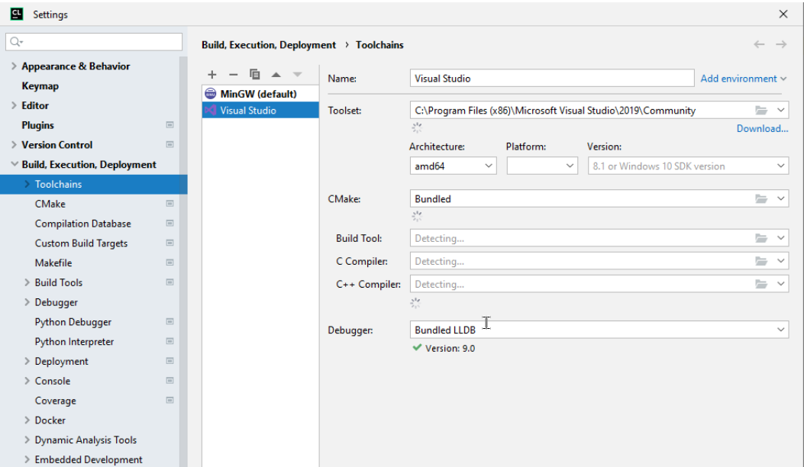

- Linux
    - You should select MinGW (GNU) to build the project.
- Mac
    - You can enter at the command line.

```shell
mkdir build && cd build
cmake ..

# build static library: lib/libvertices.a
make vertices

# build Unix example
make unix_example 
```
> You can import dependencies by loading CMakeLists.

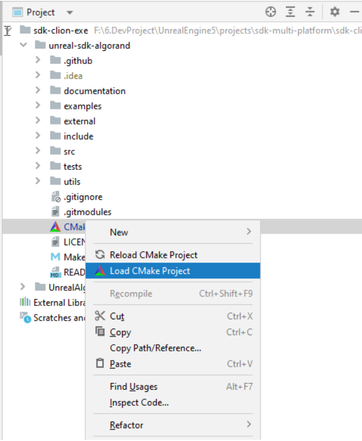

Click Build > Build All or Rebuild All to build this project.

## 3. Creating a Demo project

### Configuration
    
A config file provides an easy way to configure the SDK: include/vertices_config.h and include/vertices_types.h.

### Setting unix_config.h

Now we are creating a new file called unix_config.h on examples/unix/config folder to let it set rpc info of algorand chain.

```c
#define TESTNET_ALGOEXPLORER_API            "https://node.testnet.algoexplorerapi.io"
#define TESTNET_PURESTAKE_API               "https://testnet-algorand.api.purestake.io/ps2"
#define TESTNET_LOCAL_API                   "localhost"

#define TESTNET_ALGOEXPLORER_PORT       0
#define TESTNET_PURESTAKE_PORT          0
#define TESTNET_LOCAL_PORT              8080

#define TESTNET_ALGOEXPLORER_AUTH_HEADER    ""
#define TESTNET_PURESTAKE_AUTH_HEADER       "x-api-key:"
#define TESTNET_LOCAL_AUTH_HEADER           "X-Algo-API-Token:"
```
We are setting config info of algorand rpc. (rpc API, PORT, and AUTH 
HEADER).

In this file, you can find essential info to run a project as params.

```c
#define ACCOUNT_RECEIVER "NBRUQXLMEJDQLHE5BBEFBQ3FF4F3BZYWCUBBQM67X6EOEW2WHGS764OQXE"
#define APP_ID      (16037129)
```

**ACCOUNT_RECEIVER** is an account of the receiver and is represented as public 
32 bytes and **APP_ID** is a unique identifier when a smart contract is deployed 
to the algorand chain.

### Running a Demo project

You should install libsodium and curl library for HTTP stack and Ed25519 Signing.

If you are using the Conda environment, you can skip this step.

- macOS
    ```shell
    brew install libsodium curl
    ```
- Linux
    ```shell
    apt-get install libsodium curl
    ```

*At first*, two account variables are declared to test transactions on the algorand chain and the action of creating and loading an account and also it creates a struct type variable to let vertices lib connect with the algorand chain.

```c
typedef struct
{
   provider_info_t *provider;
   ret_code_t
   (*vertices_evt_handler)(vtc_evt_t *evt);
} vertex_t;
—---------------------------------------------------------------------------------------------
typedef struct {
   unsigned char private_key[ADDRESS_LENGTH];  //!< 32-bytes private key
   account_info_t *vtc_account;               //!< pointer to Vertices account data
} account_t;

// Alice's account is used to send data, keys will be retrived from config/key_files.txt
static account_t alice_account;
// Bob is receiving the money 😎
static account_t bob_account;
```

Next, Main.cpp has 4 big functions. (vertices_evt_handler, create_new_account, load_existing_account, main ()) 

- Vertices_evt_handler

    This function is one to let the user handle vertices events (signed, needed to sign) outside of vertices, which should be inserted into vertices lib as a function parameter when running a project and defined outside of vertices lib.

- Create_new_account

    This action is one to let the user create new random key pair consisting of the private key and public key with 32 bytes and store them as external files.

    ```c
    unsigned char ed25519_sk[crypto_sign_ed25519_SECRETKEYBYTES];
    randombytes_buf(seed, sizeof(seed));

    crypto_sign_ed25519_seed_keypair(ed25519_pk, ed25519_sk, seed);
    ```

- Load_existing_account

    This action lets the user load an existing account from external files and update the account info using the vertices function.  (balance, status)

    ```c
    err_code = vertices_account_new_from_b32(public_b32, &alice_account.vtc_account);
    VTC_ASSERT(err_code);

    LOG_INFO("💳 Created Alice's account: %s", alice_account.vtc_account->public_b32);
    ```

- Main

    This function is an entry point to let users run a demo project and test all functions that a vertice lib provides to them.

    - Initialize variables.
        ```c
        m_vertex.provider = &providers,
        m_vertex.vertices_evt_handler = vertices_evt_handler;
        ```
            
    - Getting input values to let users define the tx types they want according to opt.
        ```c
        case 'n': {
            create_new = true;
        }
            break;
        case 'p': {
            run_tx = PAY_TX;
        }
            break;
        case 'a': {
            run_tx = APP_CALL_TX;
        }
        ```
    - **Steps for building algo transactions** with vertices lib

        1. You should create new vertice lib and check the status and version of algorand provider defined on vertices lib.
            ```c
            // create new vertex
            err_code = vertices_new(&m_vertex);
            VTC_ASSERT(err_code);

            // making sure the provider is accessible
            err_code = vertices_ping();
            VTC_ASSERT(err_code);

            // ask for provider version
            provider_version_t version = {0};
            err_code = vertices_version(&version);
            if (err_code == VTC_ERROR_OFFLINE) {
            LOG_WARNING("Version might not be accurate: old value is being used");
            } else {
            VTC_ASSERT(err_code);

            ```
        2. Create a new algo account or load an existing one called Alice if it exists.
            ```c
            // Several ways to create/load accounts:
            if (create_new) {
                // 1) create new one
                err_code = create_new_account();
                VTC_ASSERT(err_code);
            } else {
                // 2) from files
                err_code = load_existing_account();
                VTC_ASSERT(err_code);
            }
            ```
        3. Create a new account called Bob with its public address to let the user test payment tx action.
            ```c
            //  3) from b32 address
            //      Note: creating a receiver account is not mandatory to send money to the account
            //      but we can use it to load the public key from the account address
            err_code = vertices_account_new_from_b32((char *) ACCOUNT_RECEIVER, &bob_account.vtc_account);
            VTC_ASSERT(err_code);
            ```
        4. Do the verification process with Alice account before building transactions.
            ```c
            if (alice_account.vtc_account->amount < 1001000) {
                LOG_ERROR("🙄 Amount available on account is too low to pass a transaction, consider adding Algos");
                LOG_INFO("👉 Go to https://bank.testnet.algorand.network/, dispense Algos to: %s",
                            alice_account.vtc_account->public_b32);
                LOG_INFO("😎 Then wait for a few seconds for transaction to pass...");
                return 0;
            }
            ```
        5. Build transactions with tx info and type.
            - **Payment TX**

                This action is one to let users send assets from one account to another Account.
                ```c
                // send assets from account 0 to account 1
                char *notes = (char *) "Alice sent 1 Algo to Bob";
                err_code =
                    vertices_transaction_pay_new(alice_account.vtc_account,(char *) bob_account.vtc_account->public_b32 /* or ACCOUNT_RECEIVER */, AMOUNT_SENT, notes);
                ```

            - **Application TX**

                This action is one to let a user send an application call.
		        You can get info on the application call tx using the following function.
                ```c
                app_values_t app_kv = {0};
                err_code = vertices_application_get(APP_ID, &app_kv);
                VTC_ASSERT(err_code);
                for (uint32_t i = 0; i < app_kv.count; ++i) {
                    if (app_kv.values[i].type == VALUE_TYPE_INTEGER) {
                        LOG_INFO("%s: %llu", app_kv.values[i].name, (long long unsigned) app_kv.values[i].value_uint);
                    } else if (app_kv.values[i].type == VALUE_TYPE_BYTESLICE) {
                        LOG_INFO("%s: %s", app_kv.values[i].name, app_kv.values[i].value_slice);
                    }
                }
                ```

                Next, build an application call tx.
                ```c
                // send application call
                app_values_t kv = {0};
                kv.count = 1;
                kv.values[0].type = VALUE_TYPE_INTEGER;
                kv.values[0].value_uint = 32;

                err_code = vertices_transaction_app_call(alice_account.vtc_account, APP_ID, &kv);
                VTC_ASSERT(err_code);
                ```
        6. Send registered txs to algorand chain. This action is one to let vertices lib process events to get signed or pending ones for the transaction process.
            ```c
            size_t queue_size = 1;
            while (queue_size && err_code == VTC_SUCCESS) {
                err_code = vertices_event_process(&queue_size);
                VTC_ASSERT(err_code);
            }
            ```
            You can get tx id using this function.
        7. Free memory of created new accounts.
            ```c
            // delete the created accounts from the Vertices wallet
            err_code = vertices_account_free(alice_account.vtc_account);
            VTC_ASSERT(err_code);

            err_code = vertices_account_free(bob_account.vtc_account);
            VTC_ASSERT(err_code);
            ```

## 4. Creating static or shared libraries of Vertices

There are some options to let users use the vertices library as static or shared libraries and recommended solutions when occurring issues.

- src/CMakeLists.txt

    You should add the following commands to use the vertices library as a static or shared type.
    - static
        ```c
        add_library(vertices STATIC ${VERTICES_SRC_FILES})
        ```

    - shared
        ```c
        add_library(vertices SHARED ${VERTICES_SRC_FILES})
        ```
    If you want to change the directory path of the output library, you should add this such commands.

- **Update the MPack module on the windows platform**

    To build as vertices which libtype has shared library on windows, you should remove the following commands on mpack/src/mpack/mpack-defaults.h file.

## 5. Tests

- CppUTest install

    Make sure you have cpputest installed:
    - Linux - sudo apt-get install cpputest lcov
    - OSX - brew install cpputest lcov

    After installing cpputest library on your OS system, you should set 

    CPPUTEST_HOME as an environment variable for CPPUTEST.
    ```c
    if(DEFINED CPPUTEST_HOME)
        message(STATUS "Using CppUTest home: ${CPPUTEST_HOME}")
        set(CPPUTEST_INCLUDE_DIRS ${CPPUTEST_HOME}/include)
        set(CPPUTEST_LIBRARIES ${CPPUTEST_HOME}/cpputest_build/lib)
        set(CPPUTEST_LDFLAGS CppUTest CppUTestExt)
    else()
        find_package(PkgConfig REQUIRED)
        pkg_search_module(CPPUTEST REQUIRED cpputest>=3.8)
        message(STATUS "Found CppUTest version ${CPPUTEST_VERSION}")
    endif()
    ```
    From **/tests** you will be able to launch the unique command to run all the test:
    ```shell
    make all
    ```
- Running Tests

    There are some test cases for the vertices library.
    - Accounts
    - Base32
    - Base64
    - BasicTX
    - Sha512_256


## Algorand Unreal Plugin Documentation
---
This plugin provides functionality for creating a wallet and building different types of transactions on the Algorand node.
This is a video link showing how to integrate our plugin with Algorand Blockchain.  
Demo Video Url:  https://youtu.be/zRjuzZP1ngY

## 1. Pre-requisites
- Unreal Engine 5.0 is supported, i.e this should be installed via the Epic Games Launcher. You can reference this link to install. 
https://docs.unrealengine.com/5.1/en-US/installing-unreal-engine/
- Windows: Visual Studio 2019 or newer, JetBrains Rider 2020.x
- macOS: Xcode 13.2.1

## 2. Installation & Enabling
- 🧰 Installation

    - Step 1

        Download the release zip file or Clone this repo from github (plugin path i.e https://github.com/Wisdom-Labs/Algorand-Unreal-Engine-SDK.git)

    - Step 2

        Copy algorand plugin to the Plugins folder on the root directory. If the Plugins folder doesn’t exist, create an empty folder called Plugins. Then rename copied plugin Algorand.
- Enabling

    You should register the plugin name into Build.cs on the Source directory of your project and rebuild a demo project.

    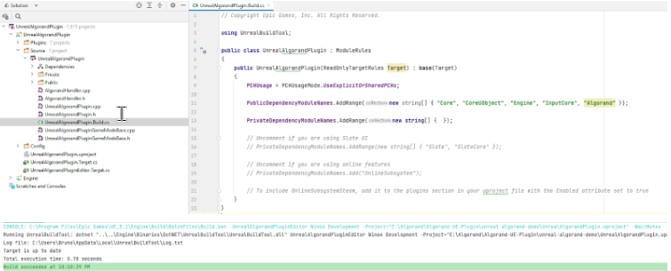

### 3. Creating a Demo project

Now we are going to create our new project. Run Unreal Engine Editor, find a project browser, and pick the Games category. Now we can see a list of available project templates we can use. Let’s just pick a Blank template, but if you are familiar with UE, you can go with any of them. On the next page, set the path and name for your project, and choose the programming language you want to go with. You can choose from C++ and Blueprint, and if you are not familiar with C++ languages, it’s better to go ahead with Blueprint. 

- **Working with C++**

    - Creating a C++ Project
    
    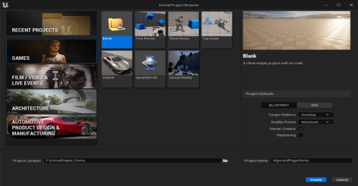

    - Waiting for the project to be created

    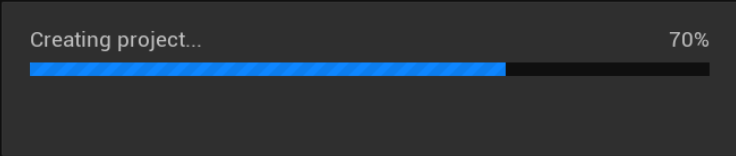

    - The Default map Blank is shown as below.

    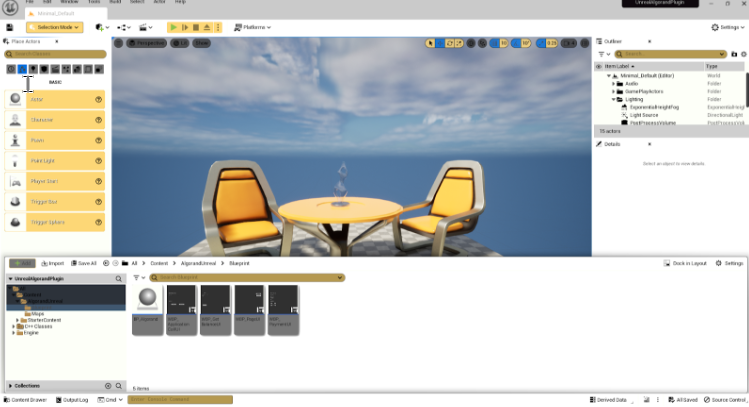

    - Install and enable the Algorand plugin as mentioned above in step 2.
    - After restarting Unreal Editor, you can check the loading status of our plugin. Select Edit > Plugins in the menu, check Algorand Plugin

    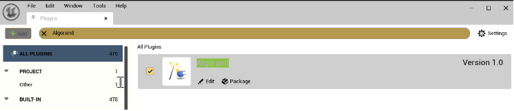

    - Select Edit > Editor Preferences > Source Code > Accessor: Source Code Editor > Rider  (if you prefer Visual Studio 2019 or newer,  you can select it)

    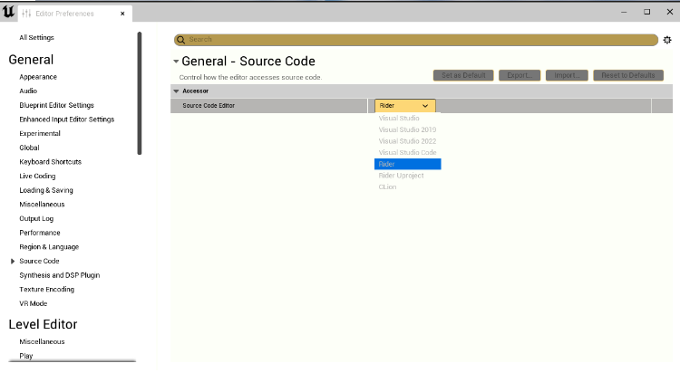

    - Click Play button

1. Creating an **AlgorandUnrealManager**

    You need to set up your project and Algorand Unreal Plugin within it.

    Setting up **AlgorandUnrealManager**

    First of all, we need to set up **AlgorandUnrealManager** to be able to use all of the API methods provided by the plugin.

    Let’s open the **Source path** of your project and create a new header named AlgorandHandler.h and AlgorandHandler.cpp

    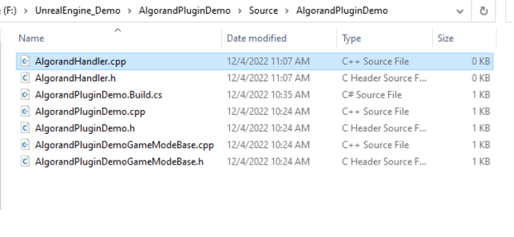

    Generate Demo project files with updates of AlgorandHandler files.

    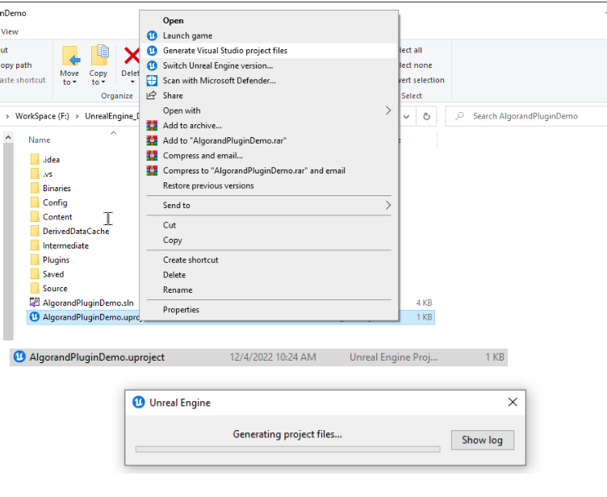

    ```c
    ….
    AlgorandHandler.h
    #pragma once

    #include "Models/FUInt64.h"
    #include "CoreMinimal.h"
    #include "UAlgorandUnrealManager.h"

    #include "AlgorandHandler.generated.h"

    UCLASS(minimalapi)
    class UAlgorandHandler : public UObject {
        GENERATED_BODY()

    public:
        UAlgorandHandler();

        UPROPERTY()
            UAlgorandUnrealManager* algorandManager;

        UWorld* GetWorld() const override;	
        UFUNCTION(BlueprintCallable, Category = "AlgorandHandler")
        void RunSomeLogic();

        UFUNCTION(BlueprintCallable, Category = "AlgorandHandler")
            void OnGetBalanceCallback(const FUInt64& amount);

        UFUNCTION(BlueprintCallable, Category = "AlgorandHandler")
            void OnSendPaymentTransactionCallback(const FString& txID);

        UFUNCTION(BlueprintCallable, Category = "AlgorandHandler")
            void OnSendApplicationCallTransactionCallback(const FString& txID);

        UFUNCTION(BlueprintCallable, Category = "AlgorandHandler")
            void OnGenerateWalletCallback(const FString& address);
    };   // UAlgorandHandler  class end
    ……….
    ```

    We’ll use this class to set up and hold the **UAlgorandUnrealManager** instance and run some code inside the RunSomeLogic method later.

    Now we are going to implement the **AlgorandHandler** class we defined above.
    ```c
    ……..
    #include "AlgorandHandler.h"

    UAlgorandHandler::UAlgorandHandler() { 
        algorandManager = CreateDefaultSubobject<UAlgorandUnrealManager>(TEXT(“AlgorandManager”));
    }

    UWorld* UAlgorandHandler::GetWorld() const { return GetOuter()->GetWorld(); }

    void UAlgorandHandler::RunSomeLogic() {
    //TODO: getbalance, payment tx , and so on…
    }

    Let’s write callback function and then add them to AlgorandHandler.cpp.

    void UAlgorandHandler::OnGenerateWalletCallback(const FString& address) {
        UE_LOG(LogTemp, Display, TEXT("Generated address in satoshis: %s"),
            *address);
    }

    void UAlgorandHandler::OnGetBalanceCallback(const FUInt64& amount) {
        UE_LOG(LogTemp, Display, TEXT("Balance in satoshis: %llu"),
            amount.Value);
    }

    void UAlgorandHandler::OnSendPaymentTransactionCallback(const FString& txID) {
        UE_LOG(LogTemp, Display, TEXT("Payment TX ID in satoshis: %s"), *txID);
    }

    void UAlgorandHandler::OnSendApplicationCallTransactionCallback(const FString& 
    txID) 
    {
        UE_LOG(LogTemp, Display, TEXT("Application Call TX ID in satoshis: %s"),*txID);
    }
    …………..
    ```
    Now, let’s rewrite something interesting inside the RunSomeLogic method.
    ```c
    …….
    void UAlgorandHandler::RunSomeLogic() {
        FScriptDelegate _delegate1;
        _delegate1.BindUFunction(this, FName("OnGetBalanceCallback"));
        algorandManager->GetBalanceCallback.Add(_delegate1);
        algorandManager->getBalance();
    }
    ……
    ```
2. Creating an AlgorandCharacter

    Tools > New C++ Class... > Common Classes > Search and select Character.

    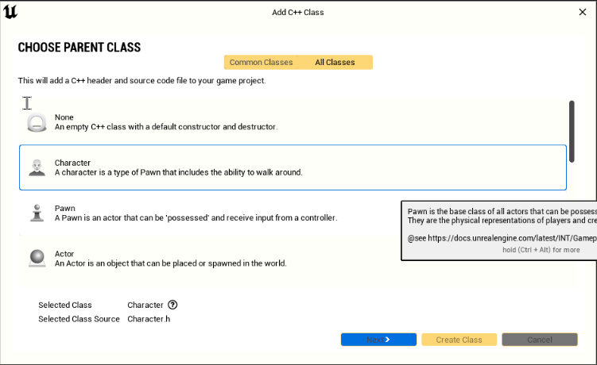

    Then create a new character named AlgorandCharacter.

    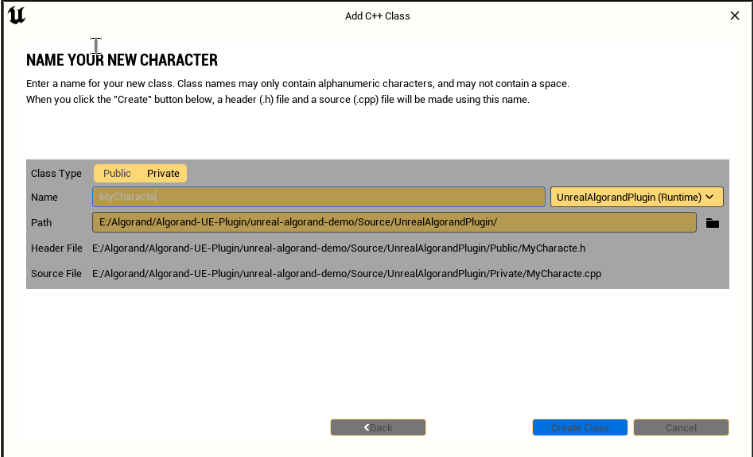

    The last thing we need to do is to make use of our UAlgorandHandler. Open …Character.h and import AlgorandHandler.h and add lines below to the class declaration.
    ```c
    UPROPERTY(VisibleAnywhere, BlueprintReadOnly, meta = (AllowPrivateAccess = 
    "true"))UAlgorandHandler* algorandHandler;

    And now add object initialization code into the character’s class constructor 
    definition:

    algorandHandler = 
    CreateDefaultSubobject<UAlgorandHandler>(TEXT("AlgorandHandler"));

    Add RunSomeLogic call to the end of BeginPlay event definition:

    algorandHandler->RunSomeLogic();
    ```
    Now we need to compile code and run the game. 

    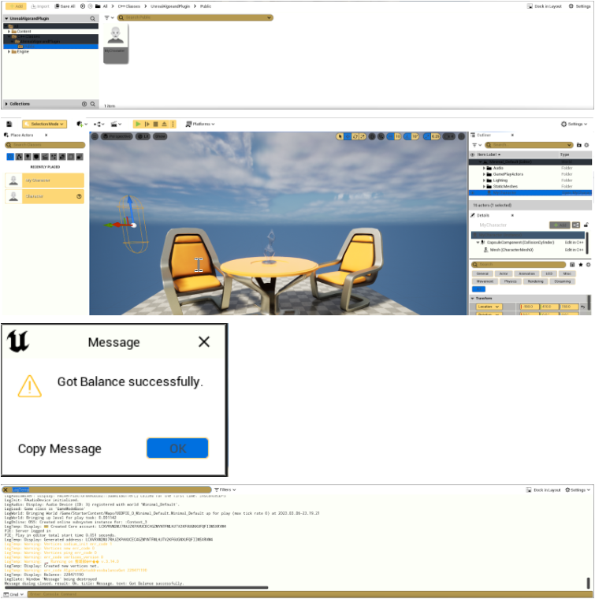

    The balance of our wallet will be printed on Output Logs.

    **Working with Blueprint**

    After removing algorandCharacter, let’s continue to work on the above project.

    Create an empty blueprint class named ***BP_Algorand***.

    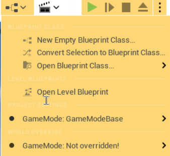

    On the Pick Parent Class panel, select the Actor item and create a blank blueprint class.

    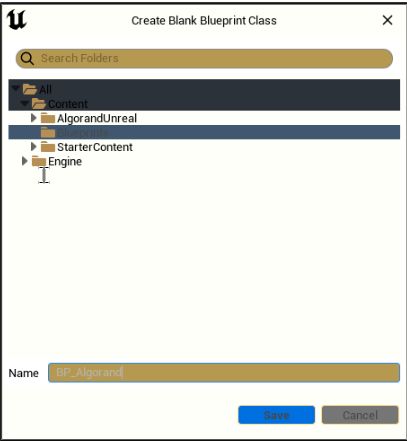

    Now we see the blueprint editor, let’s create a variable `algorandManager` with the type `Algorand Unreal Manager`.

    Let’s make *ConvertFUInt64ToString* and *ConvertFStringToUInt6* 4 like the above.

    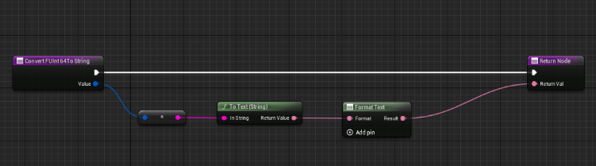

    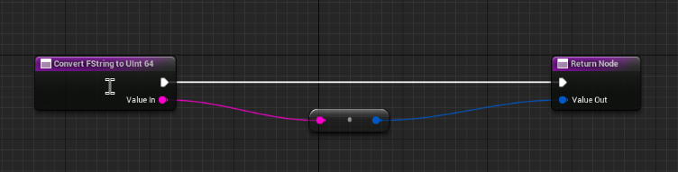

    Well, now we can call the GetBalance function and await the result. 

    Add `BindEventGetBalanceCallback` to the event graph (right after manager initialization or after manager initialization) and set its **Event** field to callback events via broadcast.

    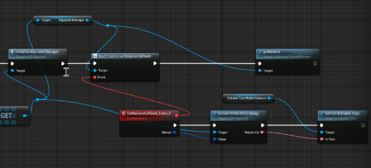
