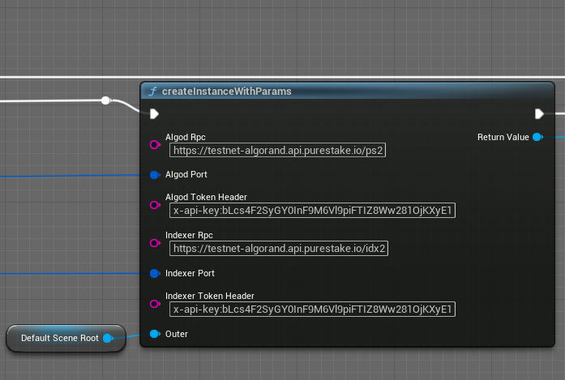
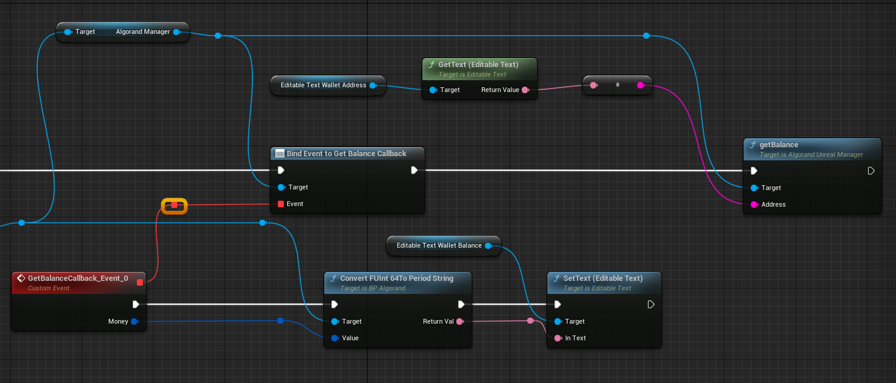
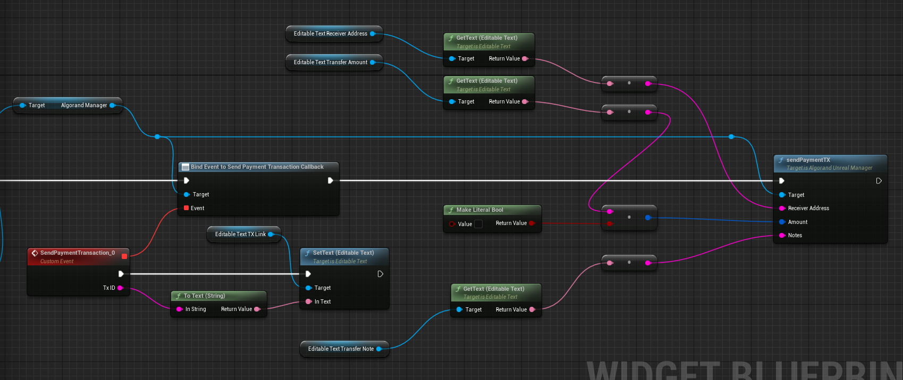

# Your First Transaction
Let's define an UClass called `UAlgorandHandler` to use an AlgorandUnrealManager.

## Initialize Algorand Manager for access to Algorand Node

You can connect to algorand mainnet, testnet and sandbox.
```c++
UPROPERTY()
		UAlgorandUnrealManager* algorandManager;

UAlgorandHandler::UAlgorandHandler() { 
	algorandManager = 
		CreateDefaultSubobject<UAlgorandUnrealManager>(TEXT("AlgorandManager"));
}
```
To alter Algorand Rest API or Network,  `setAlgodRpcInfo` and `setIndexerRpcInfo` are used to update algorand rpc information.




## Generate an Account

New Account is generated from mnemonic private key:

```c++

void UAlgorandHandler::RunSomeLogic() {
    FScriptDelegate _delegate;
    _delegate.BindUFunction(this, FName("OnGenerateMnemonicsCallback"));
    algorandManager->GenerateMnemonicsCallback.Add(_delegate);
    algorandManager->generateMnemonics();
}

void UAlgorandHandler::OnGenerateMnemonicsCallback(const FString& output) {
    UE_LOG(LogTemp, Display, TEXT("Generated mnemonics: %s"),
        *output);
}

```

Save your address and passphrase in a separate place.

> [!Warning]
> Never share your private key or mnemonic. Production environments require stringent private key management.

## Fund the Account

Before Generating transactions, your account must have more algos than minimal transaction fees. [Algorand Faucet](https://dispenser.testnet.aws.algodev.network/) dispense algos to accounts.

## Check Your Balance

To verify that you can send transactions generally, you should check your balance, which must be more than minimal fee for tx.

```c++
void UAlgorandHandler::RunSomeLogic() {
    FScriptDelegate _delegate;
    _delegate.BindUFunction(this, FName("OnGetBalanceCallback"));
    algorandManager->GetBalanceCallback.Add(_delegate);
    algorandManager->getBalance("LCKVRVM2MJ7RAJZKPAXUCEC4GZMYNTFMLHJTV2KF6UGNXUFQFIIMSXRVM4");
}

void UAlgorandHandler::OnGetBalanceCallback(const FUInt64& amount) {
    UE_LOG(LogTemp, Display, TEXT("Balance: %llu"),
        amount.Value);
}
```

Your account balance will be displayed on Message Box.



## Send a Transaction  (Payment TX)

```c++
void UAlgorandHandler::RunSomeLogic() {
    FScriptDelegate _delegate2;
    _delegate2.BindUFunction(this, FName("OnSendPaymentTransactionCallback"));
    algorandManager->SendPaymentTransactionCallback.Add(_delegate2);
    algorandManager->sendPaymentTransaction(FString("NBRUQXLMEJDQLHE5BBEFBQ3FF4F3BZYWCUBBQM67X6EOEW2WHGS764OQXE"), 100, FString("Sent 100 algo to NBRUQXLMEJDQLHE5BBEFBQ3FF4F3BZYWCUBBQM67X6EOEW2WHGS764OQXE."));
}

void UAlgorandHandler::OnSendPaymentTransactionCallback(const FString& txID) {
    UE_LOG(LogTemp, Display, TEXT("Payment TX ID: %s"),
        *txID);
}
```



## basic flow
 inherit c++ and blueprint functions  
 - GetBalance
 - Send Payment TX
 - Create Asset TX
 - Update Asset TX
 - Transfer Asset TX
 - NFT Viewer
 - Send Application TX
 - Generate wallet